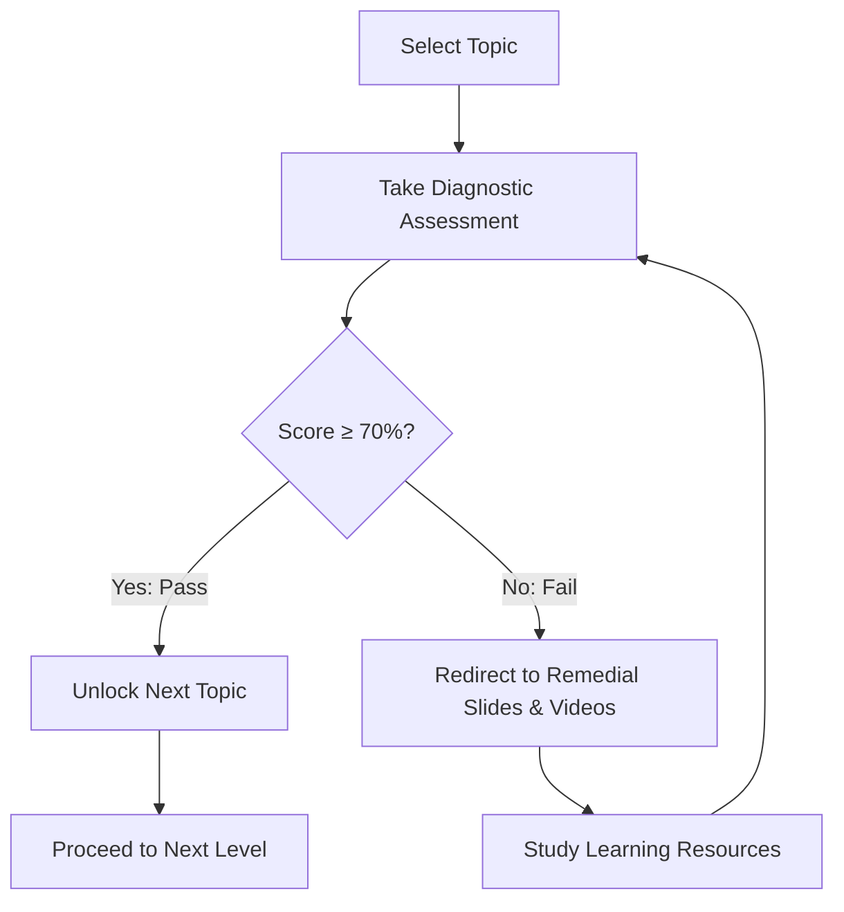
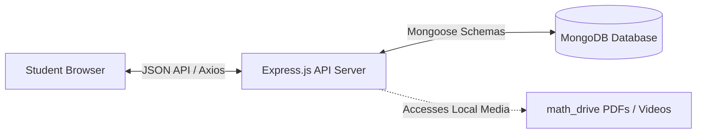

# Personalized Adaptive Learning (PAL) / DAZ Learning Platform

A modern, full-stack educational platform for Grade 12 students featuring a personalized **Assessment-First Learning Model**. 

---

## 📖 Project Overview

Traditional learning systems follow a linear model: study first, then test. The **Personalized Adaptive Learning (PAL)** platform reverses this paradigm to optimize student efficiency. 

By utilizing an **Assessment-First Approach**, students immediately take a diagnostic topic assessment to prove their current mastery:
1. **Mastery Proven ($\ge 70\%$)**: The student immediately unlocks the next subtopic, saving valuable study time.
2. **Mastery Deficient ($< 70\%$)**: The student is dynamically routed to curated learning slides and video lectures matching the specific subtopic for targeted reinforcement before re-attempting.

---

## ✨ Features

*   **Assessment-First Learning Path**: Skip redundant learning material by proving topic competence through diagnostic assessments.
*   **Dynamic Course Unlocking**: Course progress is unlocked based on passing scores ($\ge 70\%$), preventing progress without topic mastery.
*   **Targeted Learning Reinforcement**: Automatic redirection to slides and lecture videos on failure.
*   **Bilingual Content Support**: Seamless language toggle between English and Tamil slides where translated materials exist.
*   **Progress Dashboard**: User-centric tracking displaying completed topics and subject-wise completion progress.
*   **Premium Glassmorphism UI**: Beautiful, modern dashboard and workspace styled with high-performance Vanilla CSS and smooth motion transitions.
*   **Secure Authentication**: Secure student sign-up, password hashing, and token-based state persistence.

---

## 🛠️ Technology Stack

| Layer | Technology | Description |
| :--- | :--- | :--- |
| **Frontend** | React.js (Vite) | Main component-based rendering client framework |
| **State & Routes** | React Context API, React Router v6 | Authentication state sharing and client-side page routing |
| **Backend API** | Node.js, Express.js | Core web server API, routing, and controller logic |
| **Database** | MongoDB, Mongoose | NoSQL database layer and schemas modeling |
| **Styling & Assets** | Vanilla CSS, Framer Motion, Lucide Icons | Custom glassmorphism, smooth animations, and icons |
| **Authentication** | JSON Web Tokens (JWT), BCrypt.js | Secure user authentication and password hashing |

---

## 🏗️ System Architecture & Workflow

### User Workflow Diagram


### Module Relationship Model


---

## 📂 Folder Structure

```
PAL/
├── client/                     # Frontend client (React SPA)
│   ├── public/                 # Static assets (including static slides and videos)
│   └── src/
│       ├── context/            # Authentication context provider
│       ├── pages/              # Page view components (Dashboard, Assessment, Slides, etc.)
│       ├── App.jsx             # React routing configuration
│       ├── index.css           # Global custom CSS properties and design tokens
│       └── main.jsx            # Vite entry point
├── server/                     # Backend API server (Node.js/Express)
│   ├── config/                 # DB connections and environment configurations
│   ├── controllers/            # Controller layers separating route logic
│   ├── models/                 # Mongoose schemas (User, Subject, Chapter, Topic, Progress, etc.)
│   ├── routes/                 # Express REST endpoint maps
│   ├── scripts/                # Database seeding scripts (seed.js)
│   └── index.js                # Express app entry point
└── math_drive/                 # Reference directory containing source slides, PDFs, and video lectures
```

---

## 🚀 Getting Started

### Prerequisites
*   [Node.js](https://nodejs.org/) (v16+ recommended)
*   [MongoDB](https://www.mongodb.com/try/download/community) installed and running locally on standard port `27017`

### Installation Steps

1.  **Clone the Repository**
    ```bash
    git clone https://github.com/MahaManisha/PAL.git
    cd PAL/PAL
    ```

2.  **Setup and Run Backend Server**
    ```bash
    cd server
    npm install
    
    # Run the seeding script to populate initial subjects, chapters, topics, and assessments
    npm run seed
    
    # Start the server (runs on Port 5000 by default)
    npm start
    ```

3.  **Setup and Run Frontend Client**
    ```bash
    # From the PAL/PAL root directory
    cd client
    npm install
    
    # Start the Vite development server (runs on Port 5173 by default)
    npm run dev
    ```

4.  **Open in Browser**
    Go to `http://localhost:5173` to interact with the platform. Default test user credentials can be registered using the Sign Up page.
